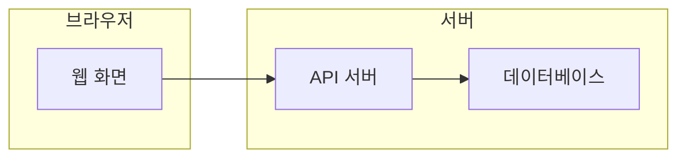

# 시스템 그림

이 제품을 이루는 부품과 바깥 상대. 부품마다 파일 하나가 폴더·층·흐름을 적는다. 그림은 아래 Mermaid 부분집합만 엔진이 읽는다:
`flowchart LR|TD` 한 줄, `subgraph <id>["<이름>"]` … `end`, `<id>["<이름>"]`, `<a> --> <b>`. 그 밖의 문법은 무시된다. 작성 안내는
`node_modules/@pghoya2956/livemap/docs/architecture-authoring.md`.

| 부품 | 파일 | 이름 | 종류 |
|---|---|---|---|
| web | [web.md](web.md) | 웹 화면 | 우리 코드 |
| api | — | API 서버 | 우리 코드 |
| db | — | 데이터베이스 | 우리 코드 |

부품 표의 `파일`은 그 부품의 폴더·층·흐름을 적은 파일이다(`—`는 아직 없음). `종류`는 `우리 코드` 또는 `바깥 상대`다. 바깥 상대가 SQL 스키마를
가지면(예: 외부 인증의 `auth`) 파일을 만들고 `- 스키마: auth` 를 적는다.
