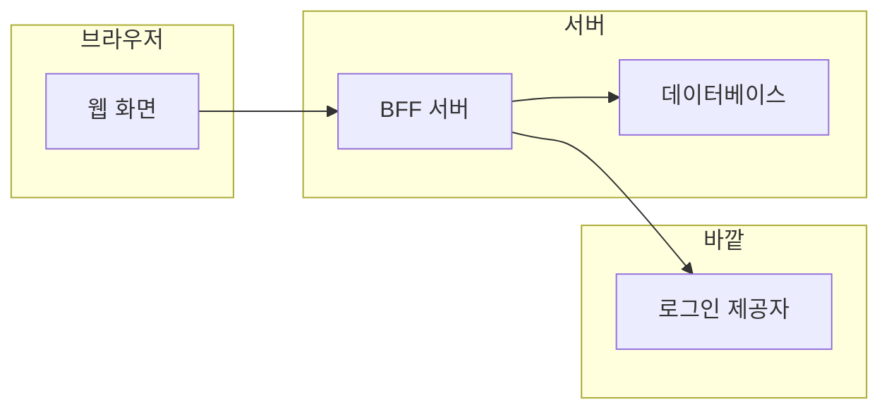

# 시스템 그림

Mini 를 이루는 부품과 바깥 상대. 부품마다 파일 하나가 층과 흐름을 적는다.

| 부품 | 파일 | 이름 | 종류 |
|---|---|---|---|
| web | [web.md](web.md) | 웹 화면 | 우리 코드 |
| bff | [bff.md](bff.md) | BFF 서버 | 우리 코드 |
| db | [db.md](db.md) | 데이터베이스 | 우리 코드 |
| auth | [auth.md](auth.md) | 로그인 제공자 | 바깥 상대 |
